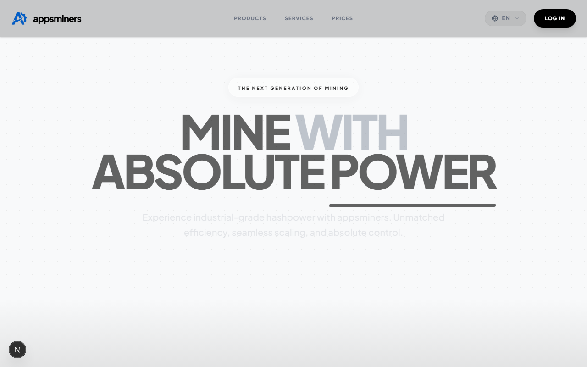
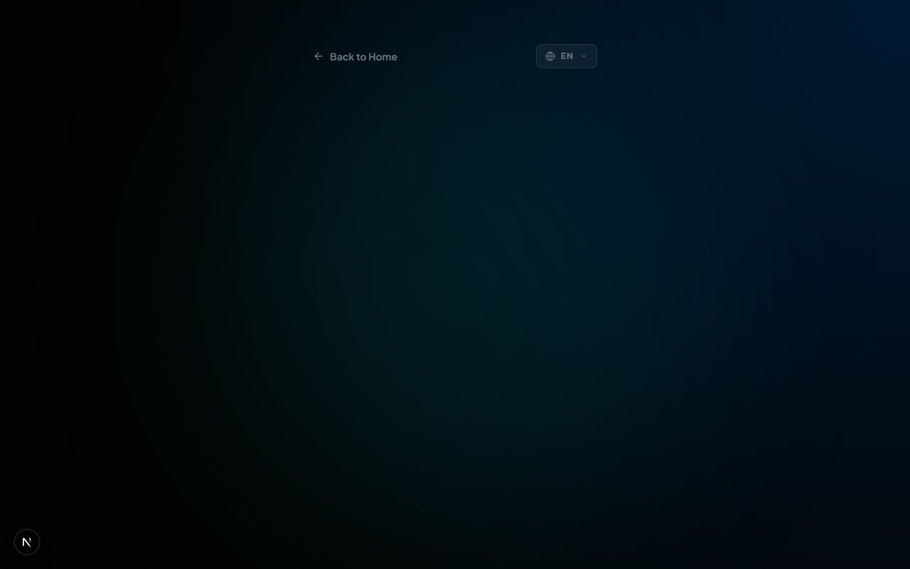
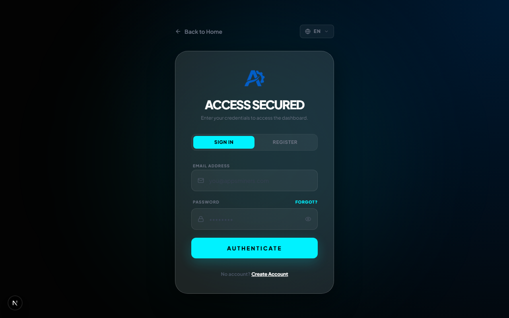

# appsminers ⚡

[](https://nextjs.org/)
[](https://www.typescriptlang.org/)
[](https://supabase.com/)
[](https://tailwindcss.com/)

> "To the next generation of engineers shaping the future of this ecosystem: Welcome to appsminers. May your builds be clean, your queries fast, and your mining pools always filled. Take this codebase, improve it, and build the next frontier." — **Lian Mollick Nehal**

appsminers is a modern, enterprise-grade web application for ASIC hardware distribution, real-time mining telemetry, and secure cryptographic storage management. Equipped with clean UI/UX, animations, multi-locale translation routing, and rigid database-level security protocols.

---

## 📸 Screenshots & Previews

### Landing Page & ASIC Catalog


### App-like Mobile Sign-In / Sign-Up


### Live Telemetry Operator Dashboard


---

## 🚀 Key Features

- 🖥️ **ASIC Telemetry Visualizer**: Displays live temperature, hashrate stats, and system overclock/shutdown parameters in real-time.
- 💳 **Secure Wallet Allocation**: Automatically provisions hot and cold vaults for registering operators to track transaction allocations.
- 🛍️ **Pre-Orders & History**: Custom component layouts sorting live hardware purchases from active hardware pre-orders.
- 🌍 **Locale Switcher**: Multilingual context covering English, French, Bengali, Arabic, and more (with dynamic RTL support).
- 📱 **App-like Mobile Optimization**: Includes locked-zoom viewports, native bottom sheets, and sticky bottom navigation on smartphone viewports.
- 🔒 **Zero-Trust Security**: Implements PostgreSQL triggers, RLS policies, parameterized SQL queries, and robust HTTP headers to defend against clickjacking or XSS.

---

## 🛠️ Tech Stack & Architecture

- **Frontend**: Next.js App Router, React 18, TypeScript, Tailwind CSS v4, Framer Motion
- **Backend & Database**: Supabase PostgreSQL with RLS, pgSQL triggers, and Auth
- **Icons & Graphics**: Lucide React

For a deep-dive walkthrough of our schemas, triggers, routing, and developer guidelines, see [APPSMINERS_DOC.md](./APPSMINERS_DOC.md).

---

## 🏁 Getting Started

### Prerequisites

- Node.js (v18+)
- A Supabase Project instance

### Install Dependencies

```bash
npm install
```

### Setup Local Environment
Create a `.env.local` file at the root of the project with your API keys:

```bash
NEXT_PUBLIC_SUPABASE_URL=https://your-supabase-id.supabase.co
NEXT_PUBLIC_SUPABASE_ANON_KEY=your-supabase-anon-key
```

### Run Locally

```bash
npm run dev
```
Open `http://localhost:3000` inside your browser to view the application.

---

## 🗄️ Database Setup (Supabase SQL)

Copy and execute the migrations inside [database_updates.sql](./database_updates.sql) and [database_schema.sql](./database_schema.sql) in your **Supabase SQL Editor** to bootstrap:
1. `profiles`, `purchases`, `nodes`, and `wallets` tables.
2. The trigger routines to automatically generate profiles and wallets for newly registered users.
3. Row Level Security (RLS) policies mapping select/update permissions strictly to owners.

---

## 🔒 Enterprise Security Measures

appsminers is built with enterprise security controls:
1. **Row-Level Security (RLS)** restricts data querying strictly to owners (`auth.uid() = user_id`).
2. **Next.js Security Headers** inside `next.config.ts` configure `X-Frame-Options: DENY`, `X-Content-Type-Options: nosniff`, and secure transport standards.
3. **Query Parameterization** is handled natively by the Supabase Client SDK, blocking NoSQL/SQL injection vectors.
